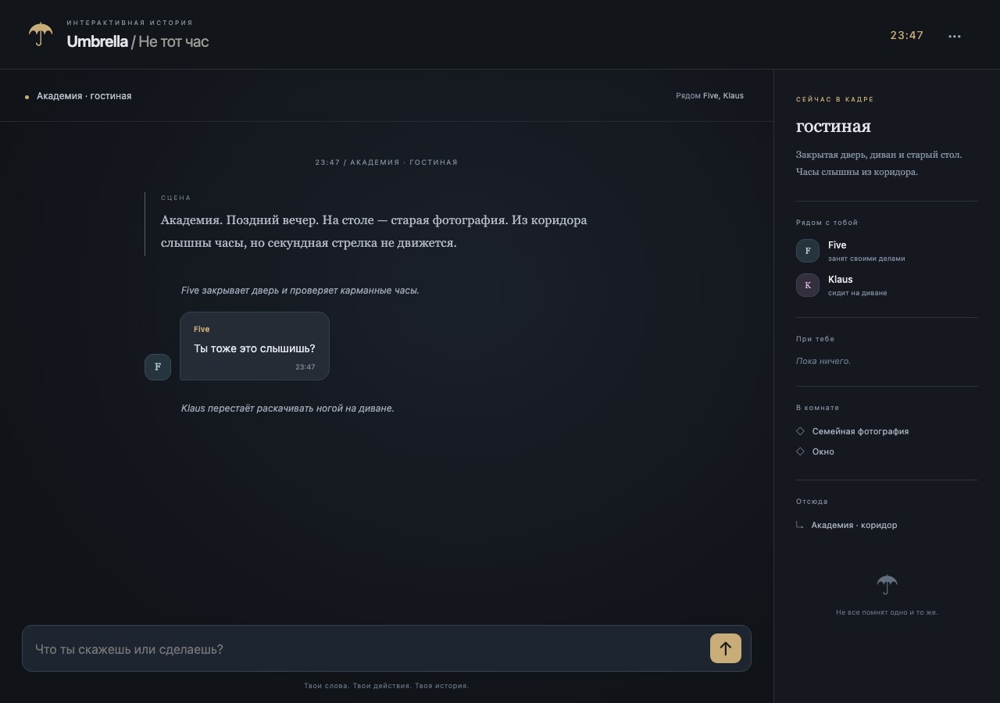

# Проверка сценической версии — 6 октября 2026

Исходный проект: `c2d0dbb`; предыдущая локальная версия PR: `0df2ccc`. Изучены server, package, world, agents, весь frontend и сохранения. Проблема предыдущей концепции: каналы и личные чаты определяли взаимодействие, а физическое присутствие не существовало. Новый основной объект — сцена; прежние API маршруты и OpenRouter сохранены.

## Текущая сцена

Старт: гостиная Академии, 23:47. Алина, Five и Klaus рядом. Diego находится в подвале и не слышит их. Лента начинается с окружения, действия Five, его реплики и реакции Klaus. Поле: «Что ты скажешь или сделаешь?».

`location`, `presentCharacters`, `time`, `situation`, `recentEvents`, `activeConflict`, `availableKnowledge`, `characterStates` вычисляются из физического World State. История содержит dialogue / action / environment / anomaly / phone / player_input; невидимые события и свидетели не экспортируются в public state. Набор свидетелей хранится в момент события.

Пример проверенного ввода: `Беру фотографию. Прячу фотографию за спину. Ухожу.` — предмет остаётся у Алины, NPC не может его осмотреть, сцена становится коридором. `Иду в спальню. Кладу фотографию на стол. Ухожу.` оставляет предмет в спальне. `Шепчу Клаусу: секрет.` не передаёт слова Five, даже если он рядом.

## Выполненные проверки

- `npm run check` — синтаксис сервера, всех модулей, app и service worker.
- `npm test` — **38 тестов прошли**. Внешняя модель подставляется тестовой функцией: реальная генерация не расходуется и не заявляется проверенной.
- `git diff --check` — без ошибок.
- `npm start` — запускается локальный HTTP сервер.
- HTTP integration: точный исходный текст игрока, разные последовательные NPC реакции, старые каналы запрещены, duplicate requestId не добавляет второй ход.
- AI dialogue/action с actor `Alina`, `Алина`, `user`, `User`, `player`, `Player`, `PLAYER`, `ALINA`, `Number Eight` и неизвестными авторами не меняют историю, локацию или предметы. `Narrator` и `System` также не разрешены как AI-авторы.
- AI environment/anomaly отвергаются. NPC action с вложенным «Алина отступила» игнорирует этот свободный текст и использует только безопасный серверный шаблон. Узнаваемая маскировка player dialogue/reaction внутри NPC text отбрасывается. Дополнительный guard appendEvent запрещает обход валидатора.
- Пришедший позже NPC не получает старый секрет; ушедший не слышит дальнейшую речь. Смешанный ввод «Ухожу. Иду на кухню. Лютер, секрет...» слышен Luther, но не оставшимся в гостиной Five/Klaus.
- Осмотр чужого/спрятанного предмета запрещён; передача требует присутствия; оставленный предмет сохраняет локацию. Телепорт NPC и создание произвольных предметов запрещены. Выход через окно требует открытого окна.
- Whisper имеет физического адресата; не достигает отсутствующего персонажа. NPC могут пересказывать услышанное другим, но пересказ остаётся новым свидетельствуемым событием, не открывает исходную приватную историю.
- Story Engine раскрывает улики постепенно. Содержимое документов/скрытой фотографии приватно читателю. Позднее раскрытие происхождения требует prerequisites и нового осмотра документа. NPC не получает WORLD.truth.
- JSON retry, provider failure, request validation, concurrency, tick cooldown, ограниченные relations/memory, encrypted snapshots, restart restoration, tampering и миграция приватных сохранений v2 проверены.
- Длинная русскоязычная лента остаётся в транспортных пределах snapshot.

## Браузер

Headless Chromium, desktop 1280×900 и mobile 390×844:

- Нет списка личных AI-чатов. Начало сразу в сцене; speech/actions/environment имеют разные визуальные типы.
- Исходный пользовательский ход ровно один и сохраняется после reload.
- Переход в коридор и инвентарь отображаются из серверного state.
- Мобильная панель открывается и закрывается; не перекрывает свою кнопку закрытия. Есть отдельная кнопка и Escape.
- При добавлении нового события повторно не анимируется вся история.
- `scrollWidth=390`, `innerWidth=390`: горизонтального overflow нет.
- Уменьшение viewport до 390×460: input y=388, height=35, полностью доступен. Это имитация доступной высоты, **не** физическая клавиатура Safari.
- Черновик восстанавливается; service worker управляет страницей; offline reload сохраняет ленту и черновик.
- `pageerror`: 0.

Сценарий: `scripts/browser-smoke.cjs`, запуск с отдельно доступным Playwright и локальным сервером без ключа. Скриншоты визуально проверены:

[Мобильная сцена](previews/mobile-scene.png), [уменьшенный viewport](previews/mobile-keyboard.png).

## Что не подтверждено

Реальные ответы новой версии OpenRouter не проверены: API-ключ хранится на Render и локально недоступен. Тесты подтверждают адаптер, валидацию и обработку ошибок, но не художественное качество бесплатной модели. Физический iPhone, Safari, настоящая клавиатура, Add to Home Screen и notifications iOS не проверены.

Рабочий Render остаётся прежней версией. У подключённого GitHub-аккаунта READ-доступ к исходному репозиторию, поэтому доставка через существующий fork/PR; деплой не выполнен. Здоровье прежнего URL не подтверждает новую генерацию.

Физические операции ограничены графом помещений и важными предметами. Сложный бой, разрушение и нестандартные способности пока остаются попытками, а не произвольно завершёнными действиями. Свободную речь LLM нельзя гарантировать от всех смысловых галлюцинаций. Установлен каркас сюжетных узлов; полный длительный художественный playtest сезона не выполнен.

Ограничения бесплатной инфраструктуры: квоты OpenRouter, холодный старт Render, локальные snapshots вместо облачной БД, до 600 событий / 220 КБ ленты, 18 memories на NPC. При закрытом приложении нет симуляции и фоновых push.

## Изменённые файлы в этой переработке

- `server.js`, `world.json`, `package.json`
- `lib/world-state.js`, `lib/physical-actions.js`, `lib/story-engine.js`
- `lib/character-agents.js`, `lib/validator.js`, `lib/simulation.js`, `lib/save.js`
- `public/index.html`, `public/app.js`, `public/style.css`, `public/manifest.webmanifest`, `public/sw.js`
- `test/api.test.js`, `test/simulation.test.js`, `test/retention.test.js`
- `scripts/browser-smoke.cjs`
- `README.md`, `docs/VERIFICATION.md`
- `docs/previews/desktop-scene.png`, `docs/previews/mobile-scene.png`, `docs/previews/mobile-keyboard.png`

`agents.json`, серверный OpenRouter endpoint, runtime dependencies и PNG/SVG PWA icons сохранены. В совокупном PR также остаются прежние добавления `.env.example`, `.gitignore`, `package-lock.json` и иконки.

## Follow-up: empty scene and autonomous NPCs

- `npm test`: 40 passing tests, including idempotent opening AI, all seven agents receiving idle decisions, no season disclosure in NPC contexts and three resolutions from physical state. Model calls are mocked.
- `npm run check`: passes, including the private season module.
- Local `/api/health` reports `ai:false`, `durableSave:true`. Real OpenRouter generation remains unverified and unavailable until a local key is configured.
- The existing browser displayed recovery/export buttons for the old rejected save. A new local browser tab displayed all four opening events and an enabled input, plus an explicit missing-AI notice. Screenshot: `previews/recovery-scene.jpg`.
- The in-app browser stalled on a native confirmation dialog. Confirmation now uses page buttons. The complete restart-button path was not verified in the stalled tab. No claim of restored old encrypted world state is made.
- Automatic `.env` loading means ordinary `npm start` uses the existing local stable save secret, rather than generating a different secret each time.
- After the opening, NPC movement no longer uses the scripted Diego-arrival route. Each AI agent chooses its own valid actions; the director advances world events and releases evidence.
- Production has not been deployed or changed by this follow-up.

Changed files in this follow-up: `server.js`, `lib/season.js`, `lib/character-agents.js`, `lib/story-engine.js`, `public/app.js`, `public/sw.js`, `package.json`, `package-lock.json`, `test/api.test.js`, `test/simulation.test.js`, `README.md`, this verification report and `docs/previews/recovery-scene.jpg`.
